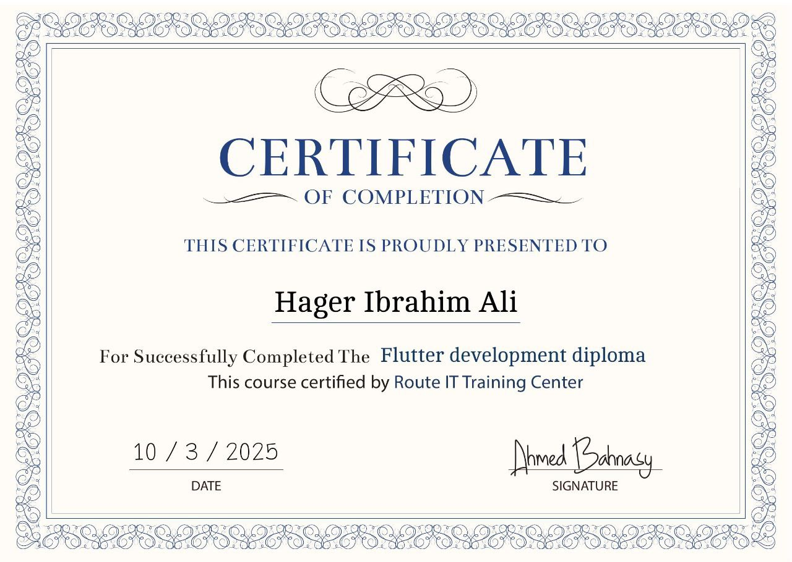

# Hi, I'm Hager Ibrahim 👋
### Flutter Developer | Software Engineer 

Graduate of **Faculty of Computers and Information, Menoufia University (2023)**. 
Currently a trainee in the **Egypt Digital Pioneers Initiative (EDPI)** by MCIT.

---

## 🚀 About Me
- 📱 Developing high-performance, cross-platform mobile apps using **Flutter & Dart**.
- 🛠 Passionate about **Clean Architecture** and building scalable solutions.
- 🎓 Academic Excellence: Awarded for my **AI-based Graduation Project**.

## 🛠 Tech Stack
- **Framework:** Flutter
- **Language:** Dart, C++, Java
- **Backend:** Firebase, REST APIs
- **Tools:** Git, GitHub, Postman, Figma

## 🏆 Featured Projects
- **Cairo Metro Navigator:** A smart transit app with pathfinding and GPS location.
- **Doctor App (Graduation Project):** Healthcare platform integrated with AI.

---

## 🎖 Honors & Recognition

| Graduation Shield | Route Academy Certificate |
| :---: | :---: |
|  |  |

- **Faculty Graduation Shield:** Recognized for outstanding academic performance at Menoufia University.
- **EDPI Scholarship:** Selected for professional Flutter training by the Ministry of Communications.
- **Flutter Diploma:** Successfully completed professional training at Route Academy.

---

## 📫 Connect with me:
[LinkedIn](https://www.linkedin.com/in/hager-ibrahim-a026401b0) | [GitHub Profile](https://github.com/Hager220)
